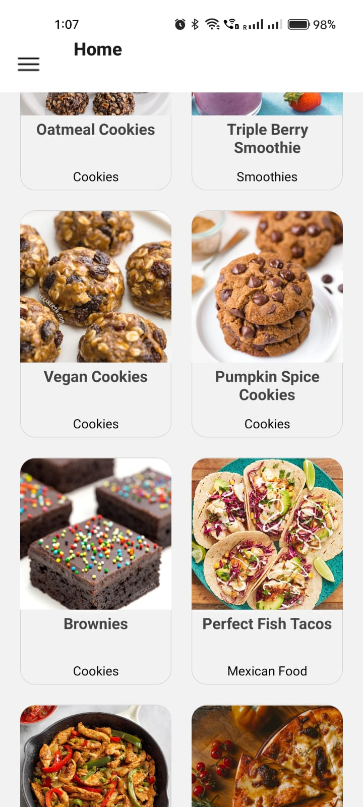
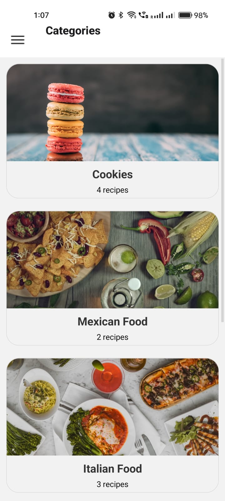
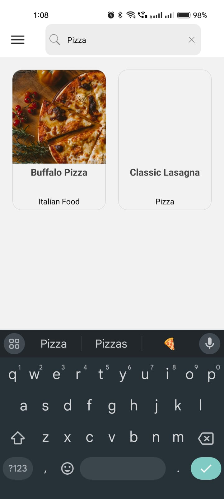
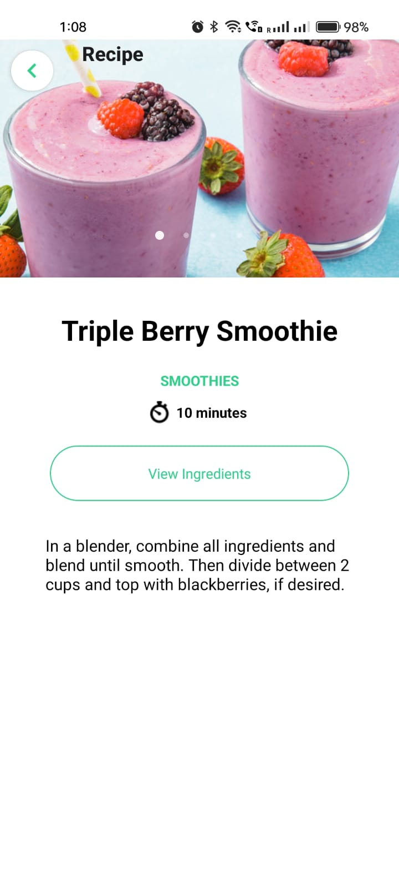
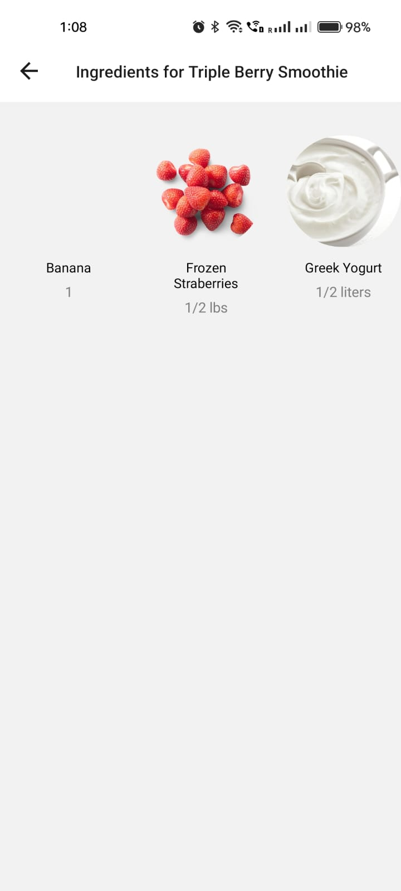

# Tech for mobile apps
## Personal Mobile App Project Final 
## Cooking Guide
##  Team 29
Name: 
1 Kamati Kalyan-(M15891125)
2 Samskruthi Reddy Musku-(M15891416)

## Application desciption
the "Cooking Guide" app is designed to be a comprehensive cooking companion, offering a seamless experience from recipe discovery to meal preparation. Users will find a wide range of recipes spanning various cuisines, dietary preferences, and cooking styles within the app's extensive database. From quick weekday dinners to elaborate weekend feasts, the app caters to diverse tastes and preferences.

## Key features of the "Cooking Guide" app include:
- Recipes List
- Categories
- Ingredients
- Recipes Details Screen
- Photo Gallery
- Detailed Description
- Ingredients button
- Ingredients List
- Recipes by Ingredient
- Search
# App in Expo Go - Screenshots 

# here is the code for application
[CookingGuide/App.js](CookingGuide/App.js)
